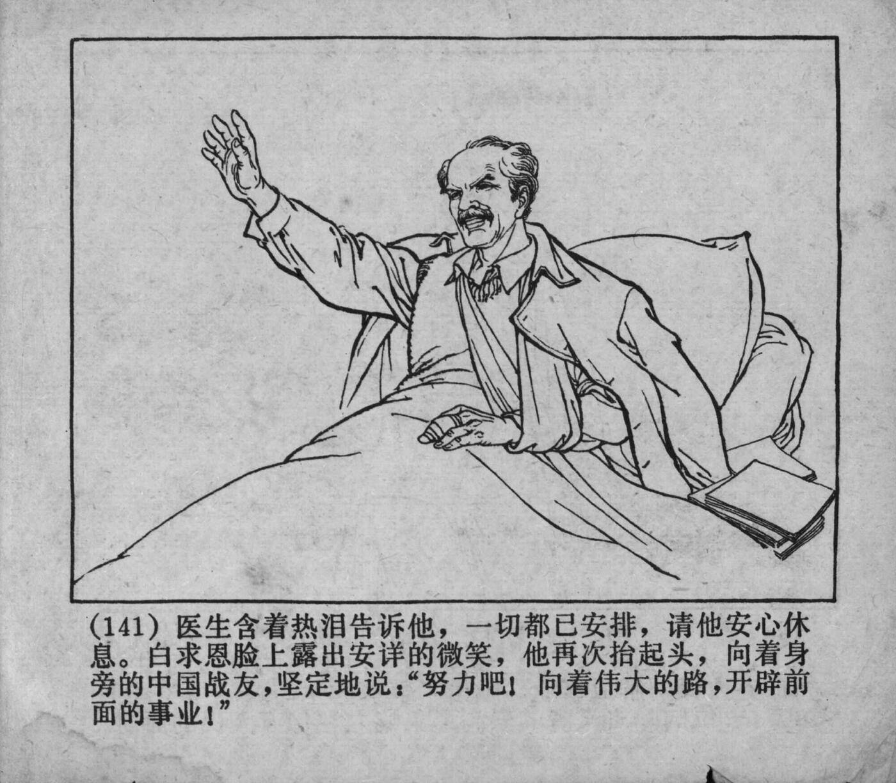



（141）医生含着热泪告诉他，一切都已安排，请他安心休息。白求恩脸上露出安详的微笑，他再次抬起头，向着身旁的中国战友，坚定地说：“努力吧！向着伟大的路，开辟前面的事业！”

<--->

(141) With tears in his eyes, the doctor told him that everything had been arranged and advised him to rest assured. Bethune’s face lit up with a serene smile, and he raised his head once more, looking at the comrades beside him, with determination, he said: “Keep fighting! Forge ahead on the great path and blaze a trail for future endeavors!”


    