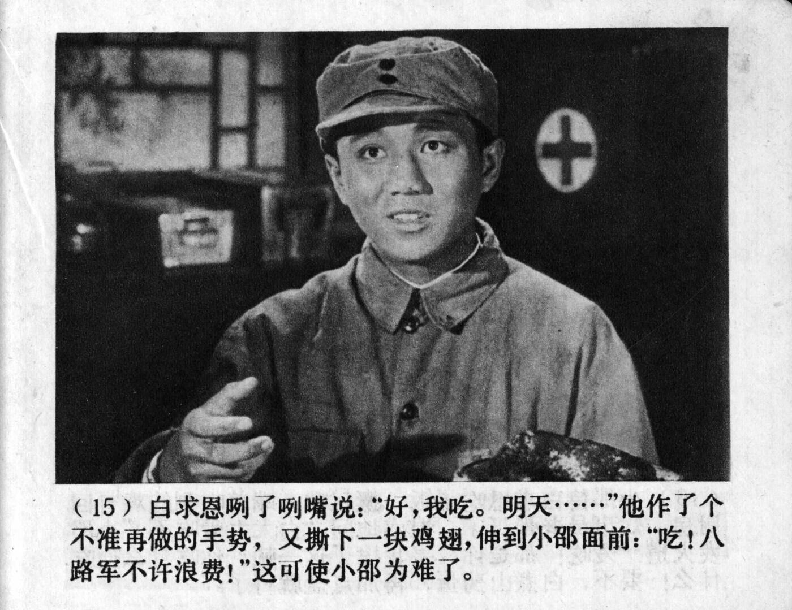



（15）白求恩咧了咧嘴说：“好，我吃。明天……” 他作了个不准再做的手势，又撕下一块鸡翅，伸到小郡面前： “吃！八路军不许浪费！” 这可使小郡为难了。

<--->

(15) Bethune grinned: “Alright, I’ll eat it. But tomorrow...” He made a gesture indicating that this should not happen again, then tore off a piece of chicken wing and held it out to Xiao Shao: “Eat! The Eighth Route Army does not allow waste!” This put Xiao Shao in a difficult position.


    