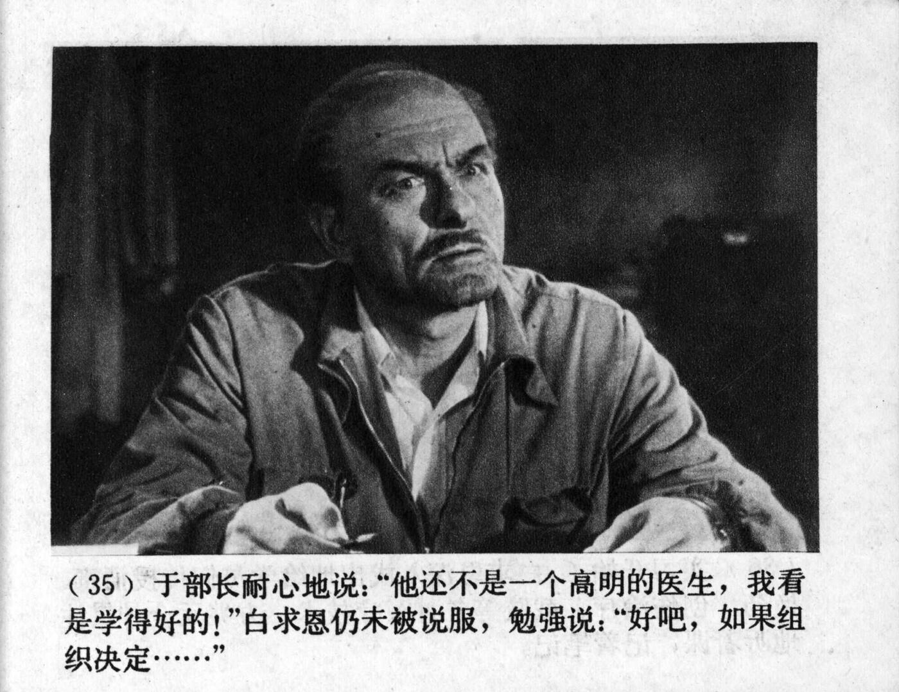



（35）于部长耐心地说：“他还不是一个高明的医生，我看是学得好的！”白求恩仍未被说服，勉强说：“好吧，如果组织决定……”

<--->

(35) Minister Yu patiently explained: “He may not be a skilled doctor yet, but I believe he has the potential to learn!” Bethune remained unconvinced but reluctantly said: “Alright, if the organization decides...”


    