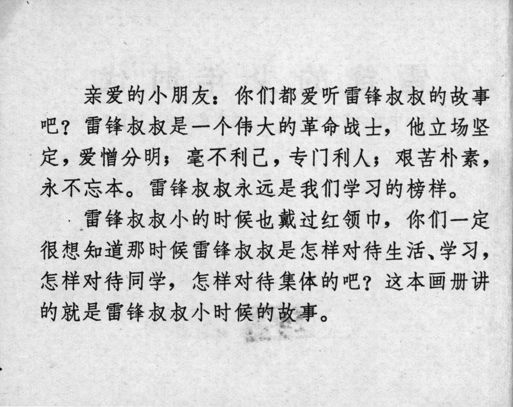



亲爱的小朋友：你们都爱听雷锋叔叔的故事吧？雷锋叔叔是一个伟大的革命战士，他立场坚定，爱憎分明；毫不利己，专门利人；艰苦朴素，永不忘本。雷锋叔叔永远是我们学习的榜样。
雷锋叔叔小的时候也戴过红领巾，你们一定很想知道那时候雷锋叔叔是怎样对待生活、学习，怎样对待同学，怎样对待集体的吧？这本画册讲的就是雷锋叔叔小时候的故事。

<--->

Dear Little Friends: You all love hearing stories about Uncle Lei Feng, don’t you? Uncle Lei Feng was a great revolutionary soldier—he was steadfast in his beliefs, clear in his loves and hates; selfless, always putting others first; hardworking, humble, and never forgetting his roots. Uncle Lei Feng will always be a role model from whom we can learn. 
When Uncle Lei Feng was young, he also wore a red scarf. You must be curious about how he treated his life, studies, classmates, and the collective back then, right? This lianhuanhua tells the story of Uncle Lei Feng’s childhood.


