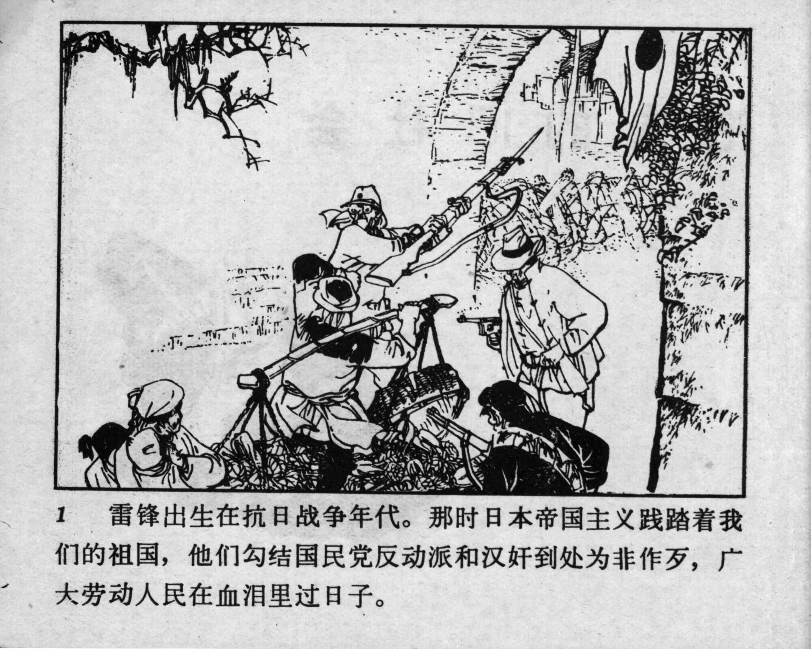



1 雷锋出生在抗日战争年代。那时日本帝国主义践踏着我们的祖国，他们勾结国民党反动派和汉奸到处为非作歹，广大劳动人民在血泪里过日子。

<--->

Lei Feng was born during the War of Resistance against Japan. At that time, the Japanese imperialists trampled on our motherland, colluded with the Guomindang (GMD) reactionaries and traitors, and committed atrocities of all kinds, so that the vast labouring people lived through days in blood and tears.


