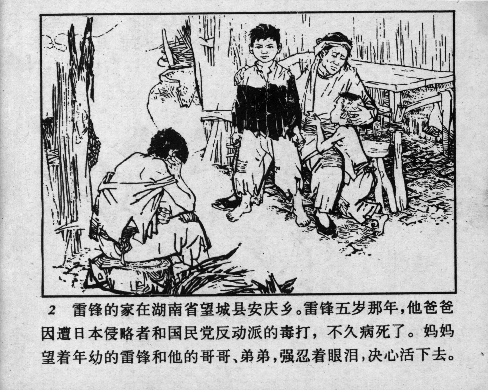



2 雷锋的家在湖南省望城县安庆乡。雷锋五岁那年，他爸爸因遭日本侵略者和国民党反动派的毒打，不久病死了。妈妈望着年幼的雷锋和他的哥哥、弟弟，强忍着眼泪，决心活下去。

<--->

Lei Feng’s home was in Anqing Township, Wangcheng County, Hunan Province. When Lei Feng was five years old, his father died of a severe beating by the Japanese invaders and Guomindang reactionaries. Looking at her little son Lei Feng and his brothers, Lei Feng’s mother held back her tears and resolved to carry on.


