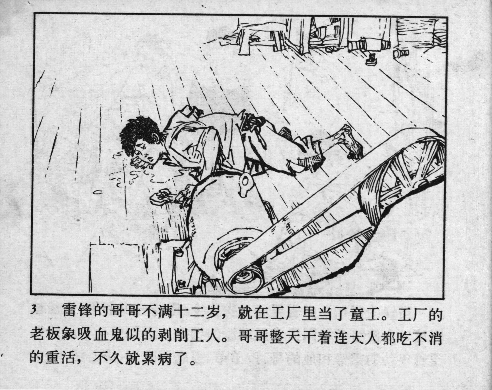



3 雷锋的哥哥不满十二岁，就在工厂里当了童工。工厂的老板象吸血鬼似的剥削工人。哥哥整天干着连大人都吃不消的重活，不久就累病了。

<--->

Not yet 12 years old, Lei Feng’s brother started working as a child labourer in a factory. The factory owner exploited the workers mercilessly like a vampire. His brother worked long hours every day, performing heavy tasks that even adults could not bear, and soon became seriously ill from exhaustion.


