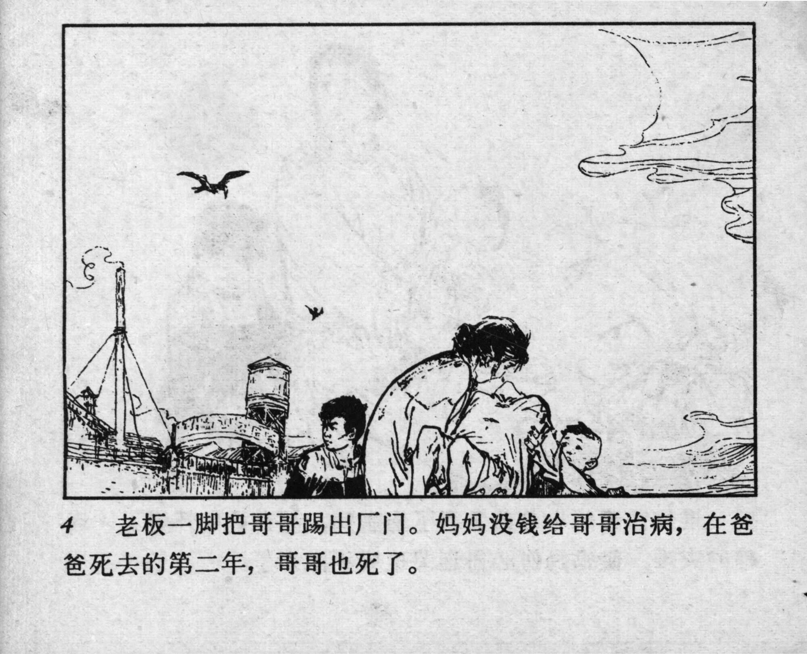



4 老板一脚把哥哥踢出厂门。妈妈没钱给哥哥治病，在爸爸死去的第二年，哥哥也死了。

<--->

The factory owner kicked Lei Feng’s brother out. Their mother had no money for his treatment. A year after their father’s death, his brother also passed away.


