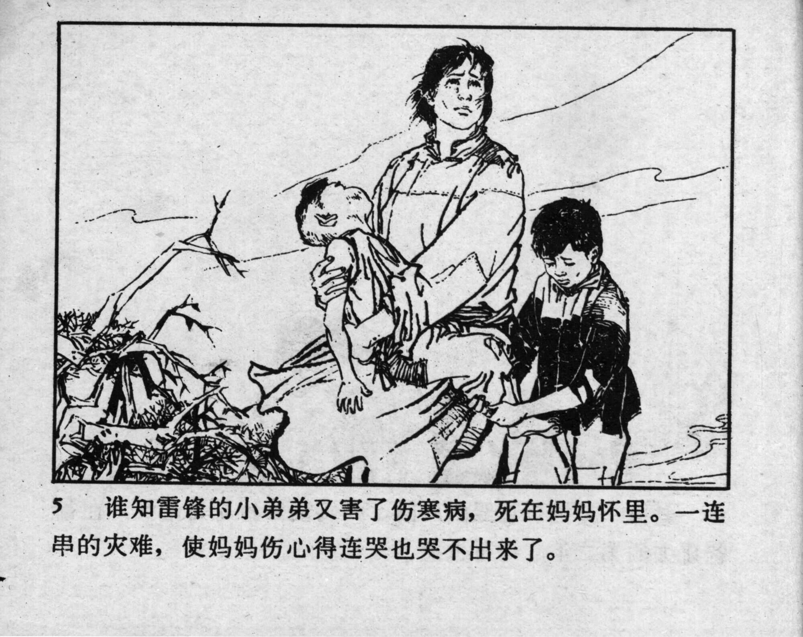



5 谁知雷锋的小弟弟又害了伤寒病，死在妈妈怀里。一连串的灾难，使妈妈伤心得连哭也哭不出来了。

<--->

Unexpectedly, Lei Feng’s younger brother fell ill with typhoid and died in his mother’s arms. This series of disasters left their mother so heartbroken that she could not even cry.


