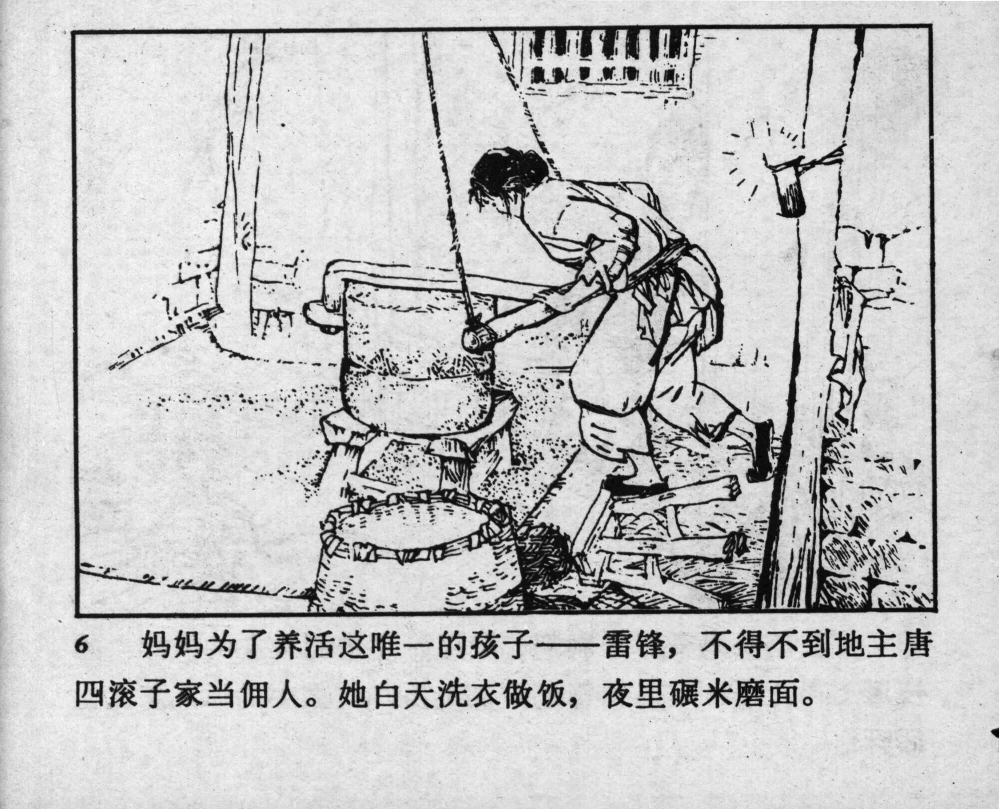



6 妈妈为了养活这唯一的孩子——雷锋，不得不到地主唐四滚子家当佣人。她白天洗衣做饭，夜里碾米磨面。

<--->

To support Lei Feng, her only remaining child, the mother worked as a servant at the landlord’s home, Tang Sigunzi. During the day, she washed clothes and cooked; at night, she ground rice and flour.


