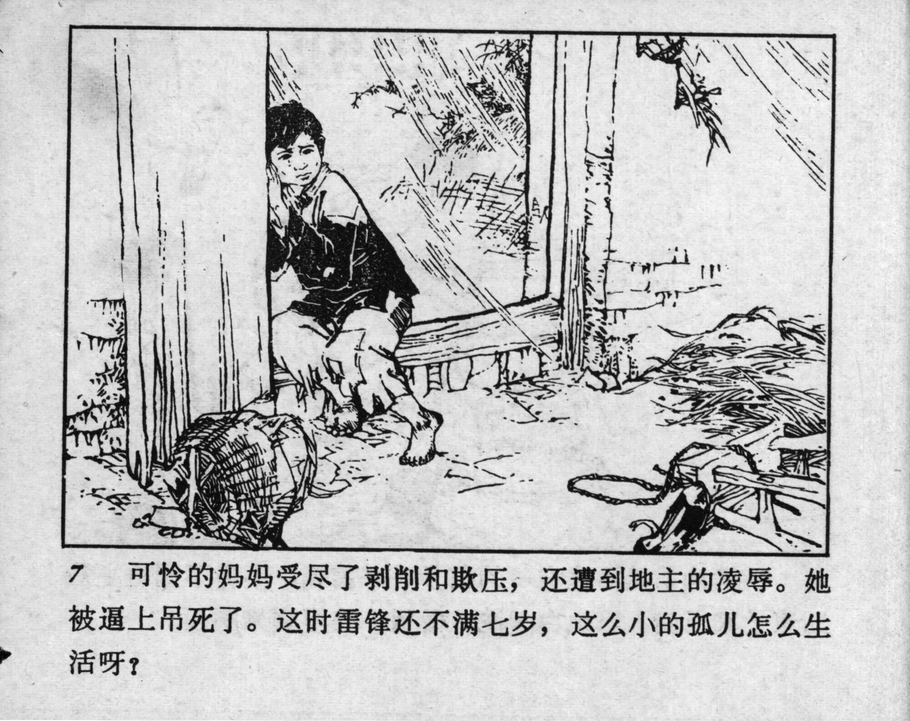



7 可怜的妈妈受尽了剥削和欺压，还遭到地主的凌辱。她被逼上吊死了。这时雷锋还不满七岁，这么小的孤儿怎么生活呀？

<--->

After being exploited and abused by the landlord, the poor mother was driven to hang herself. By this time, Lei Feng was not even seven. How could he survive as an orphan at such a young age?


