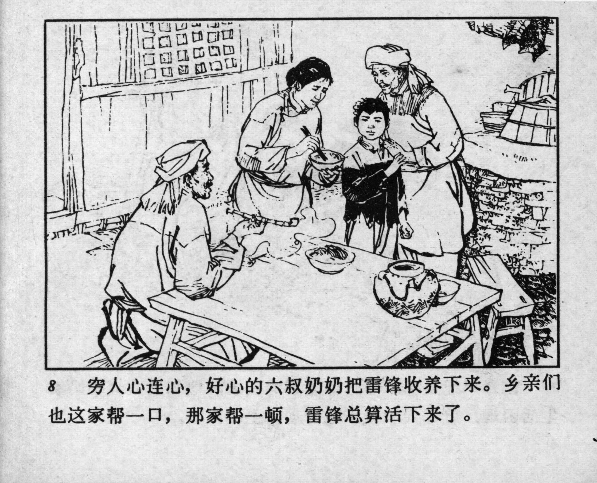



8 穷人心连心，好心的六叔奶奶把雷锋收养下来。乡亲们也这家帮一口，那家帮一顿，雷锋总算活下来了。

<--->

The poor have a unity of spirit. The kind-hearted Great-aunt Six took Lei Feng in as her own. The villagers also helped him, offering food from one household to the other, and Lei Feng survived.


