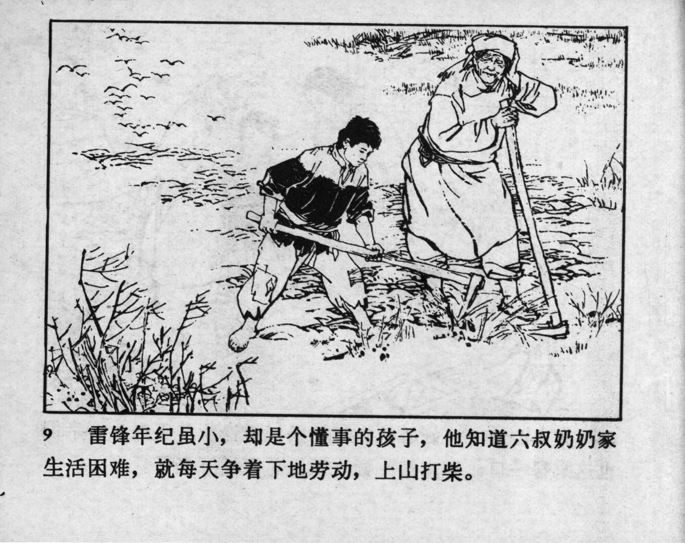



9 雷锋年纪虽小，却是个懂事的孩子，他知道六叔奶奶家生活困难，就每天争着下地劳动，上山打柴。

<--->

Even though Lei Feng was still young, he was a very reasonable child. He knew that Great-aunt Six had a hard life, so he eagerly helped with the daily chores, went to the fields and gathered firewood in the mountains.


