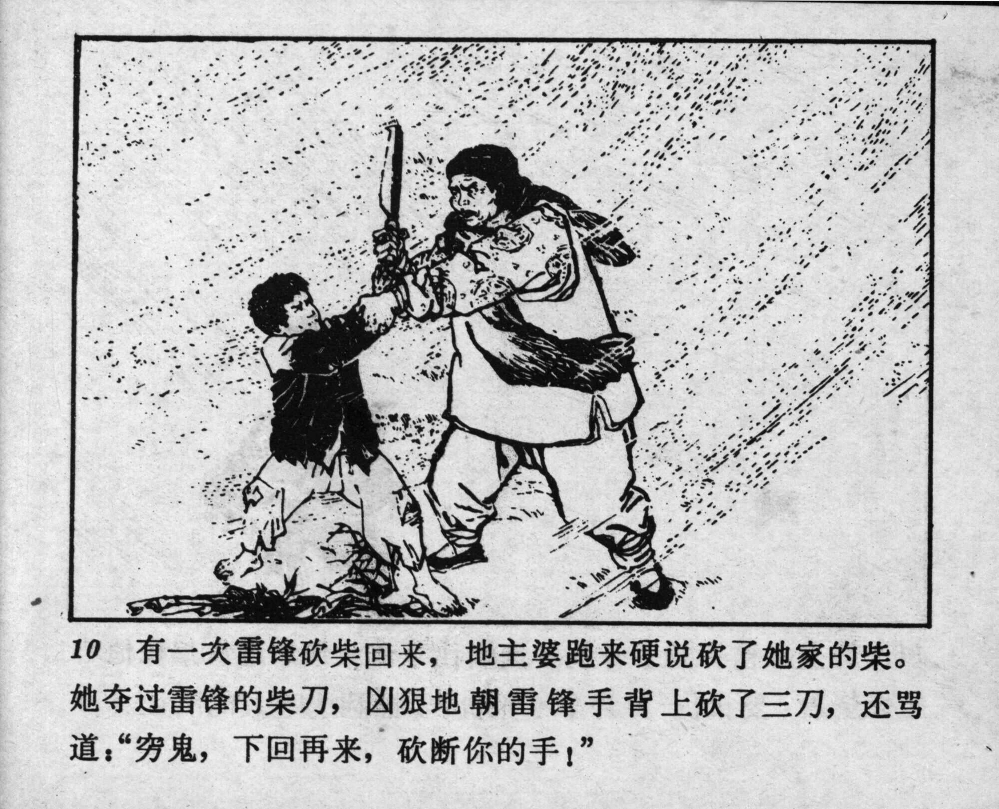



10 有一次雷锋砍柴回来，地主婆跑来硬说砍了她家的柴。她夺过雷锋的柴刀，凶狠地朝雷锋手背上砍了三刀，还骂道：“穷鬼，下回再来，砍断你的手！”

<--->

Once, when Lei Feng came back from firewood chopping, the landlady asserted that he had chopped firewood on her land. She grabbed the billhook from Lei Feng’s hand and viciously slashed the back of his hand three times while cursing him: “You pauper! If you come again, I’ll cut off your hand!”


