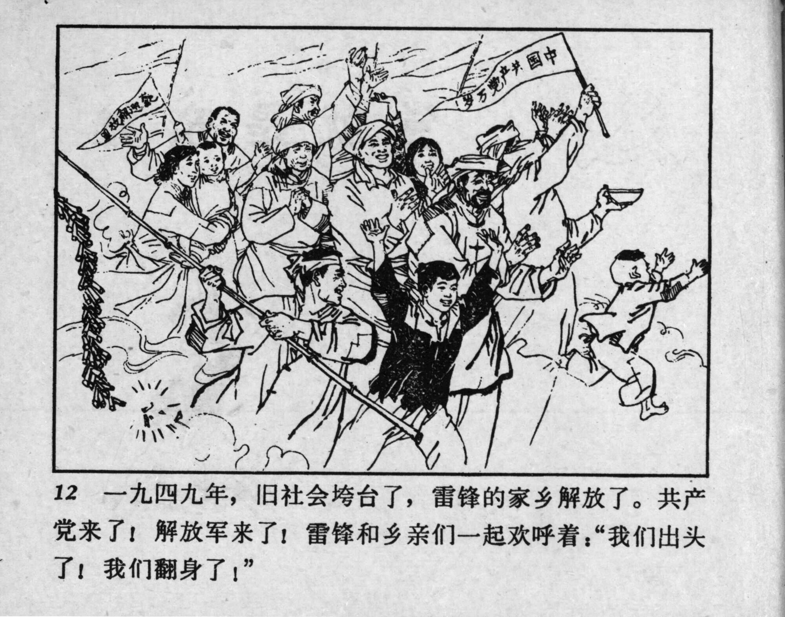



12 一九四九年，旧社会垮台了，雷锋的家乡解放了。共产党来了！解放军来了！雷锋和乡亲们一起欢呼着：“我们出头了！我们翻身了！”

<--->

In 1949, the old society had collapsed, and Lei Feng’s hometown had been liberated. The Communist Party had arrived! The People’s Liberation Army had arrived! Lei Feng and the villagers cheered together: “We have hope now! We have been freed!”


