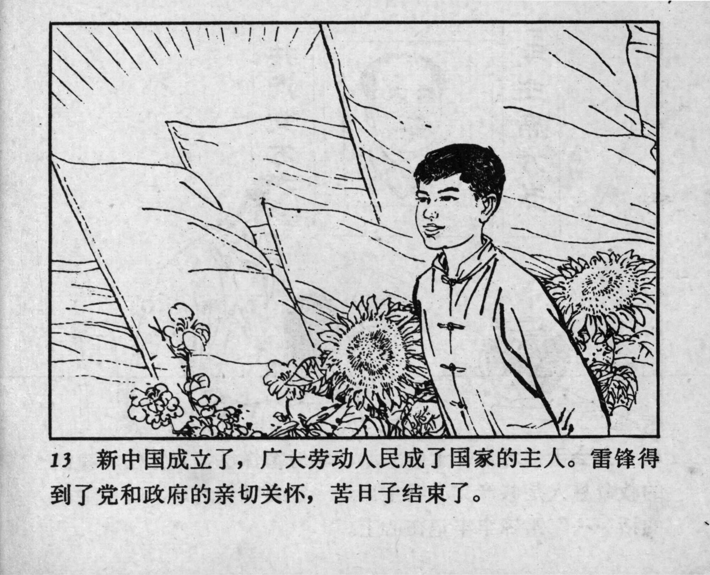



13 新中国成立了，广大劳动人民成了国家的主人。雷锋得到了党和政府的亲切关怀，苦日子结束了。

<--->

New China had been established, and the vast labouring people had become the masters of the country. Lei Feng received the warm care of the Party and the government, and his hard days came to an end. 


