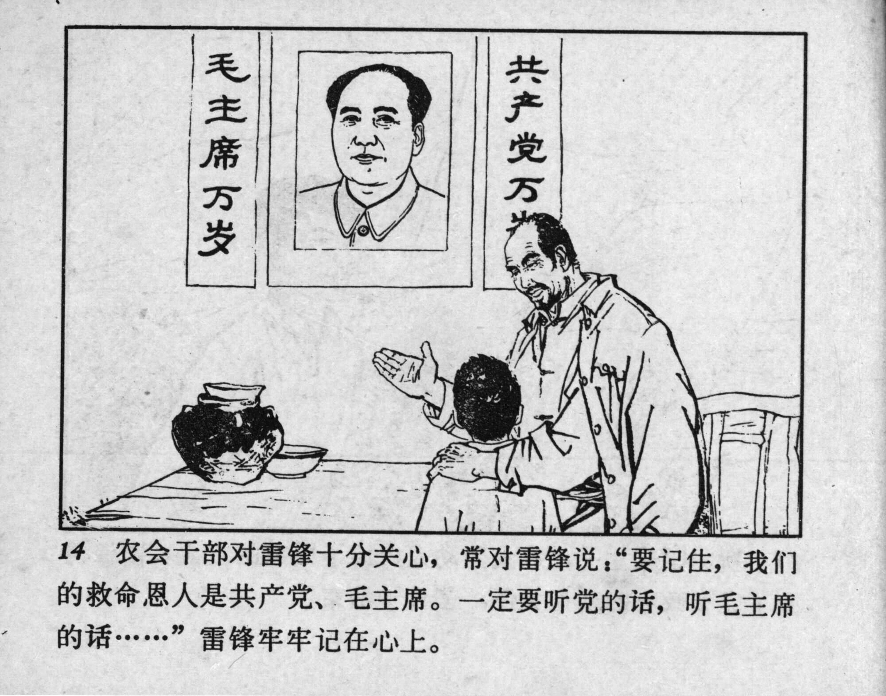



14 农会干部对雷锋十分关心，常对雷锋说：“要记住，我们的救命恩人是共产党、毛主席。一定要听党的话，听毛主席的话……”雷锋牢牢记在心上。

<--->

A cadre from the peasant association was very concerned about Lei Feng and often told him, “Remember, our saviors are the Communist Party and Chairman Mao. You must listen to the Party and listen to Chairman Mao’s words…” Lei Feng kept this firmly in his heart. 


