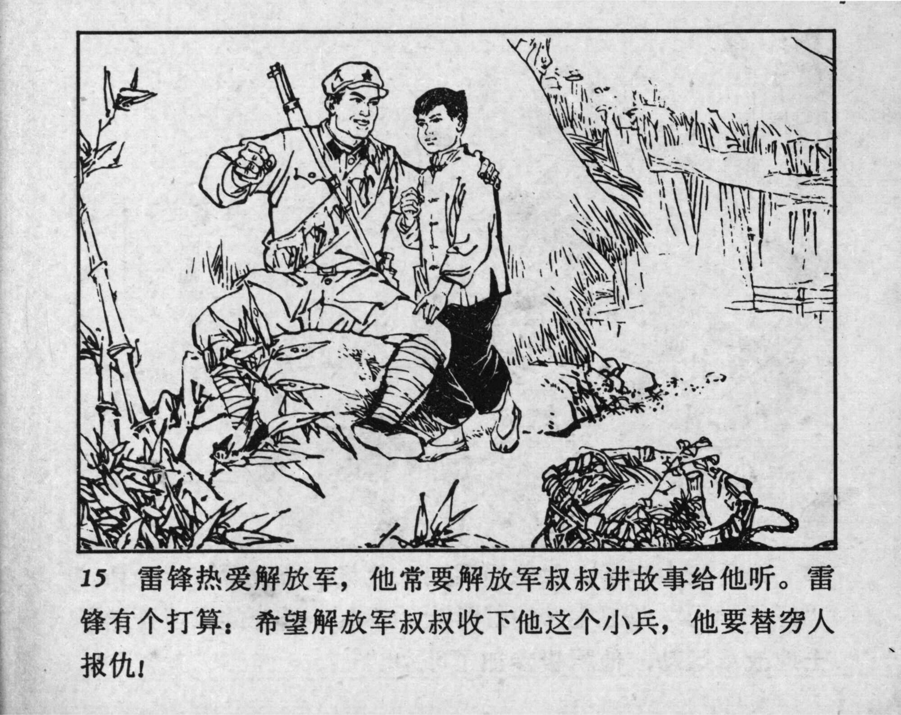



15 雷锋热爱解放军，他常要解放军叔叔讲故事给他听。雷锋有个打算：希望解放军叔叔收下他这个小兵，他要替穷人报仇！

<--->

Lei Feng loved the People’s Liberation Army, and he often asked the uncle soldiers to tell him stories. Lei Feng had a plan: He hoped these PLA uncles would take him in as a young recruit so he could avenge the poor! 


