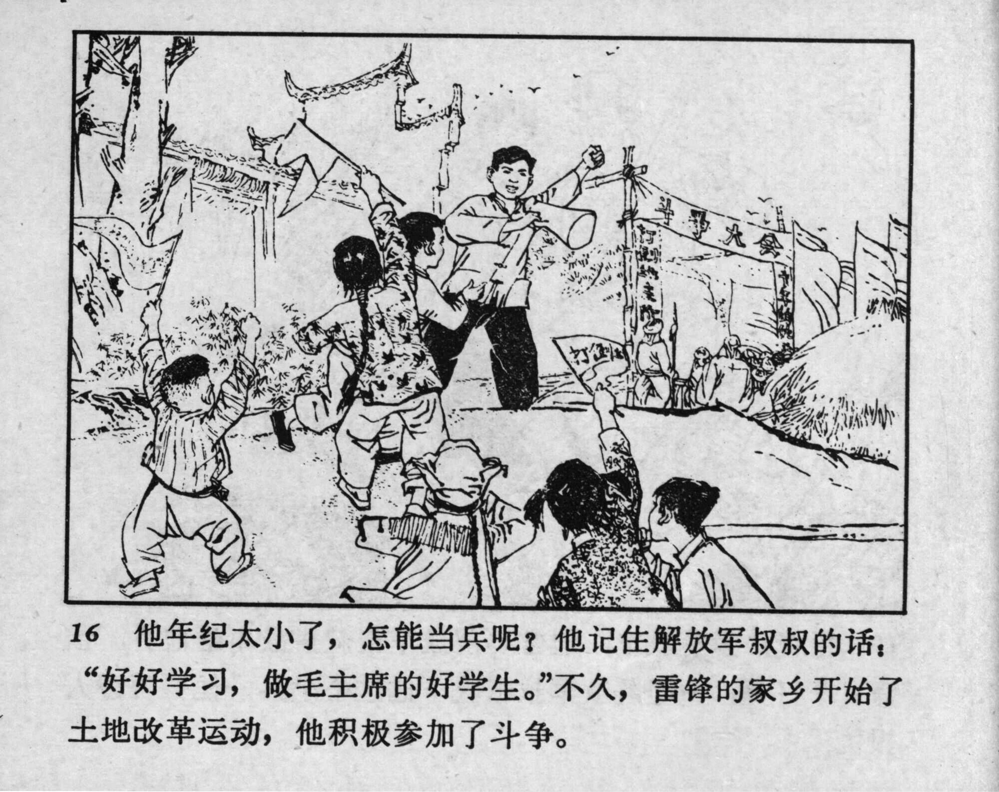



16 他年纪太小了，怎能当兵呢？他记住解放军叔叔的话：“好好学习，做毛主席的好学生。”不久，雷锋的家乡开始了土地改革运动，他积极参加了斗争。

<--->

But he was too young—how could he become a soldier? He remembered what the PLA uncles told him: “Study well and be a good student of Chairman Mao.” Soon, the Land Reform Movement began in Lei Feng’s hometown, and he actively participated in the struggle. 


