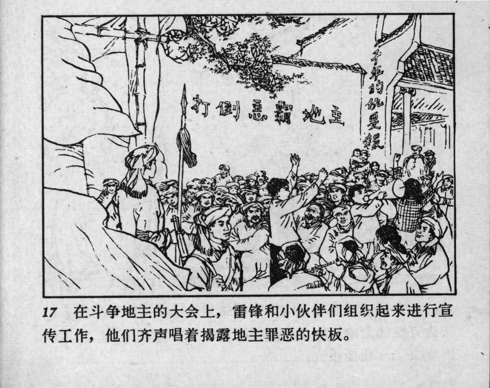



17 在斗争地主的大会上，雷锋和小伙伴们组织起来进行宣传工作，他们齐声唱着揭露地主罪恶的快板。

<--->

At a struggle meeting against the landlords, Lei Feng and his friends organized to carry out a propaganda campaign. They sang the Chinese Clapper Talk in unison, exposing the crimes of the landlords. 


