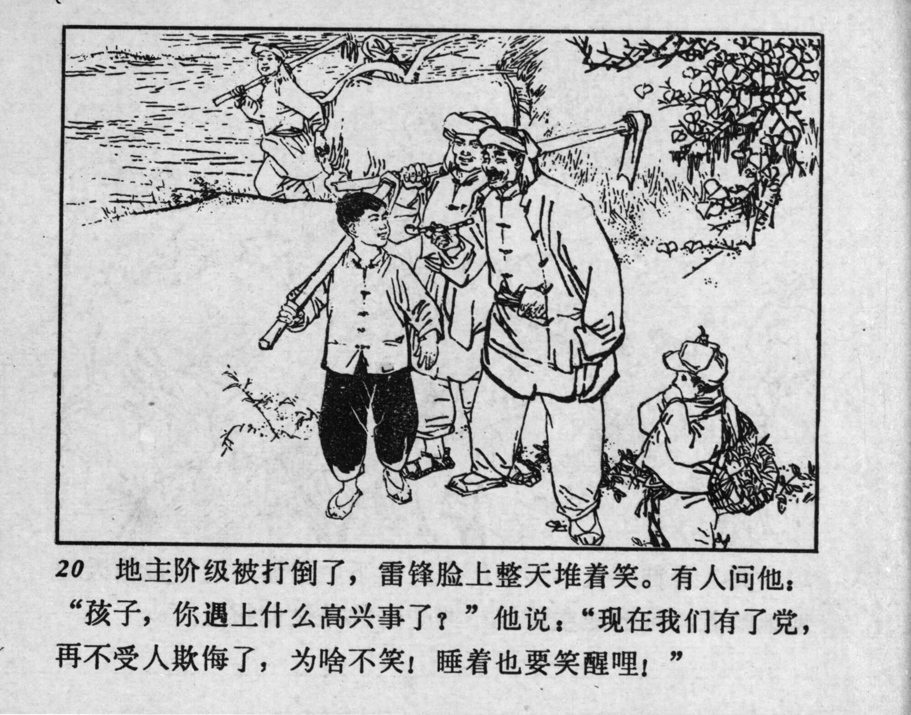



20 地主阶级被打倒了，雷锋脸上整天堆着笑。有人问他：“孩子，你遇上什么高兴事了？”他说：“现在我们有了党，再不受人欺侮了，为啥不笑！睡着也要笑醒哩！

<--->

The landlord class was defeated, and Lei Feng was smiling day and night. Someone asked him, “Child, what makes you so happy?” He replied, “Now we have the Party, and we won’t be bullied anymore. Why wouldn’t I smile? I even wake up smiling!”


