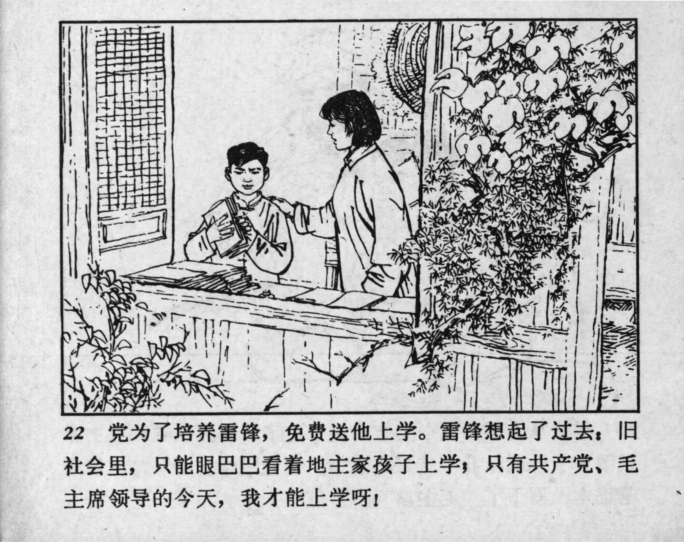



22 党为了培养雷锋，免费送他上学。雷锋想起了过去：旧社会里，只能眼巴巴看着地主家孩子上学；只有共产党、毛主席领导的今天，我才能上学呀！

<--->

To raise Lei Feng, the Party sent him to school for free. Lei Feng recalled the past: In the old society, we could only watch the landowners’ children go to school, but today, under the leadership of the Communist Party and Chairman Mao, I can go to school! 


