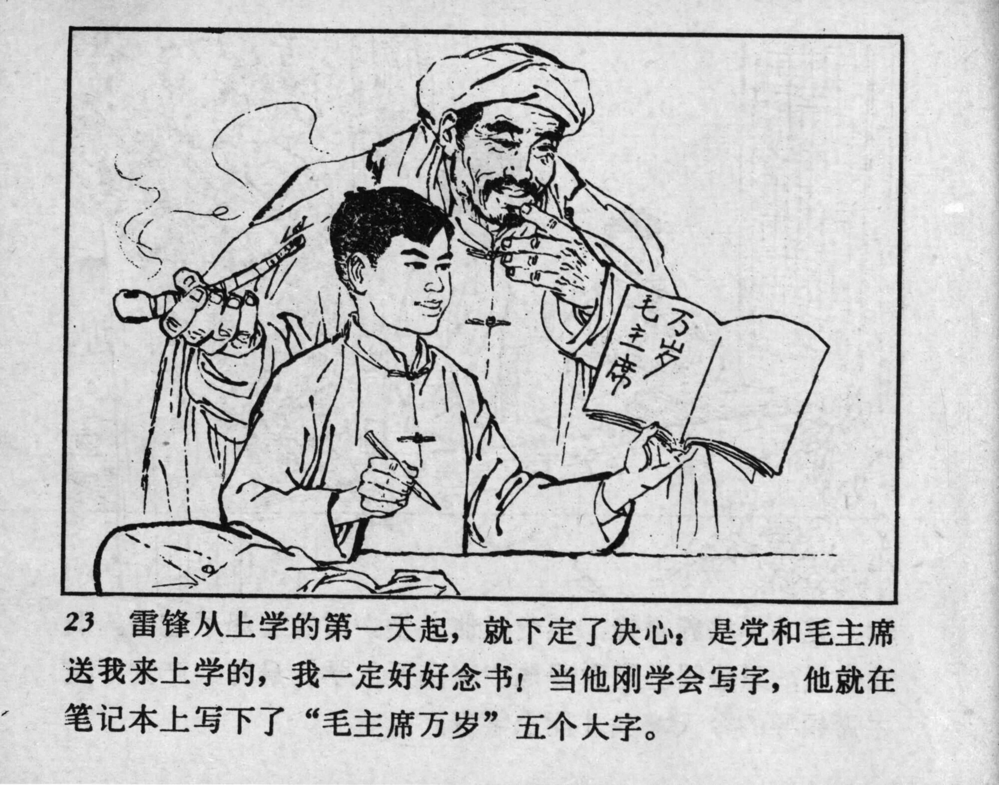



23 雷锋从上学的第一天起，就下定了决心：是党和毛主席送我来上学的，我一定好好念书！当他刚学会写字，他就在笔记本上写下了“毛主席万岁”五个大字。

<--->

On his first day of school, Lei Feng decided: The Party and Chairman Mao sent me to school, so I must study hard! As soon as he learned to write, he wrote “Long Live Chairman Mao” in his notebook. 


