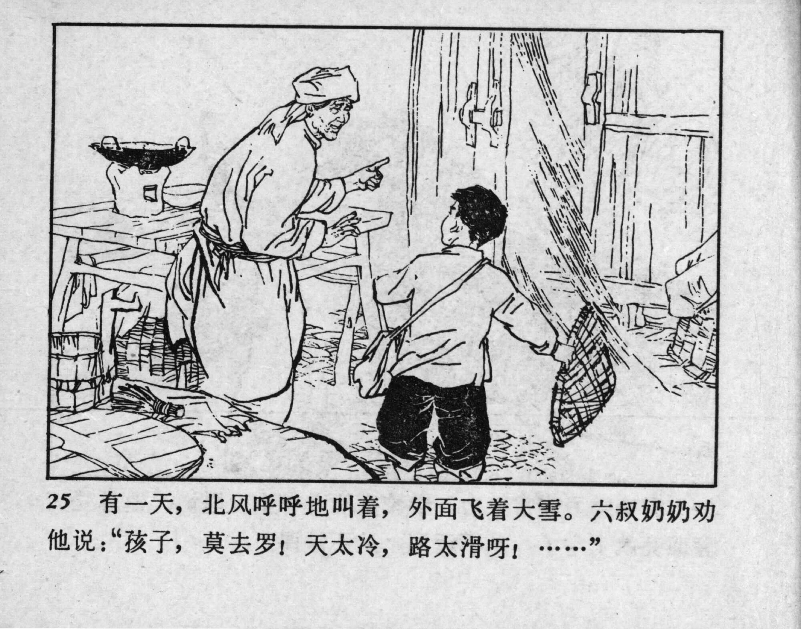



25 有一天，北风呼呼地叫着，外面飞着大雪。六叔奶奶劝他说：“孩子，莫去罗！天太冷，路太滑呀！……”

<--->

One day, the wind was howling, and the snow was flying outside. Great-aunt Six advised him: “Boy, don’t go outside! It’s too cold, and the road is too slippery to walk on! ...” 


