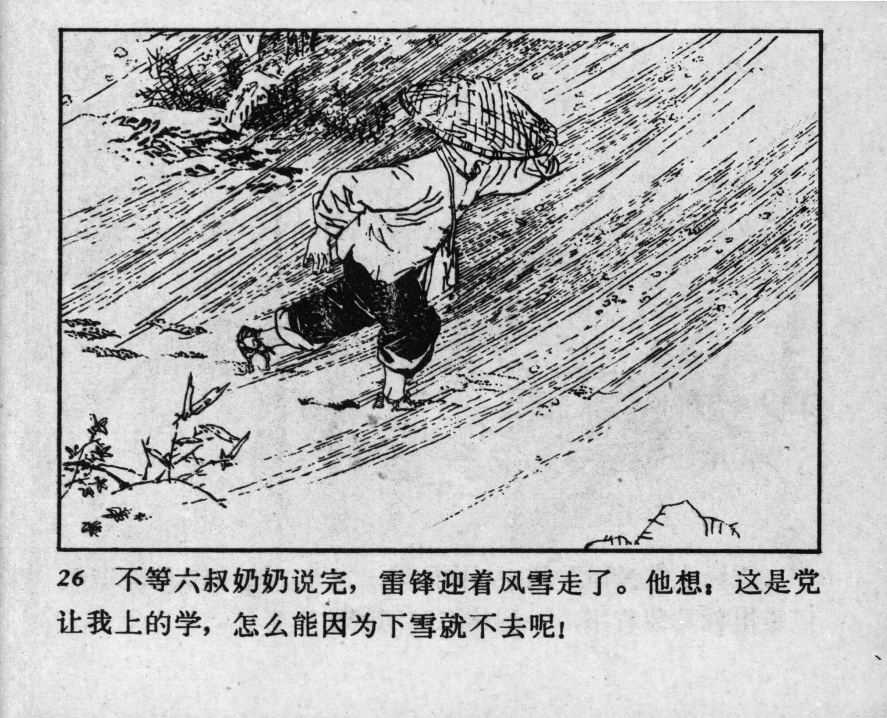



26 不等六叔奶奶说完，雷锋迎着风雪走了。他想：这是党让我上的学，怎么能因为下雪就不去呢！

<--->

Lei Feng left home facing the wind and snow without waiting for her to finish. He thought: “The Party gave me the chance to attend school! How can I not go just because of the snow?” 


