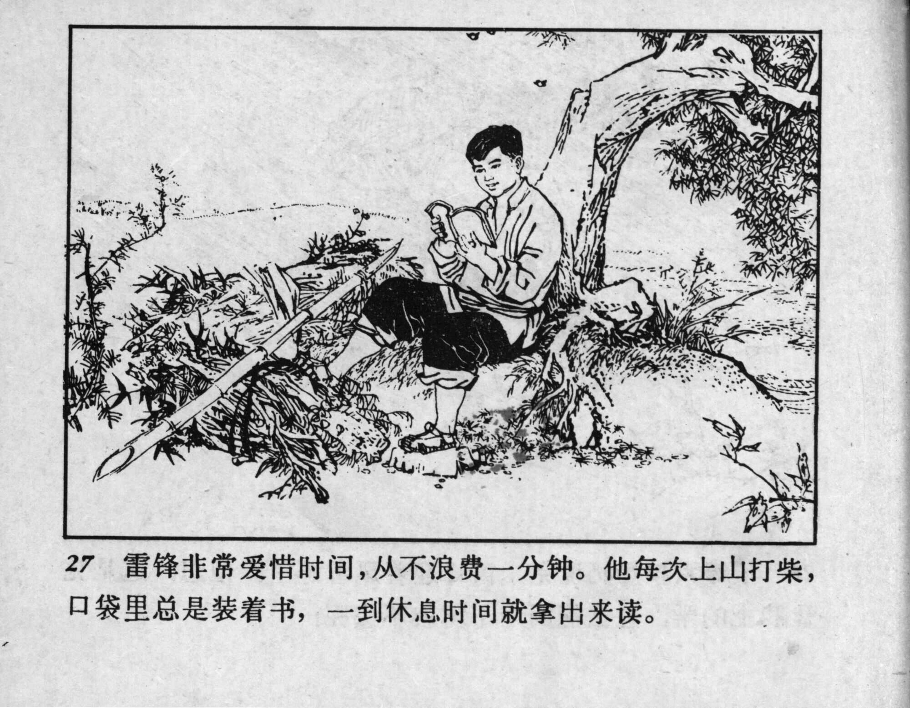



27 雷锋非常爱惜时间，从不浪费一分钟。他每次上山打柴，口袋里总是装着书，一到休息时间就拿出来读。

<--->

Lei Feng valued his time and never wasted a minute. He always carried a book in his pocket when he went up into the mountain for firewood and would take it out to read whenever he had a break. 


