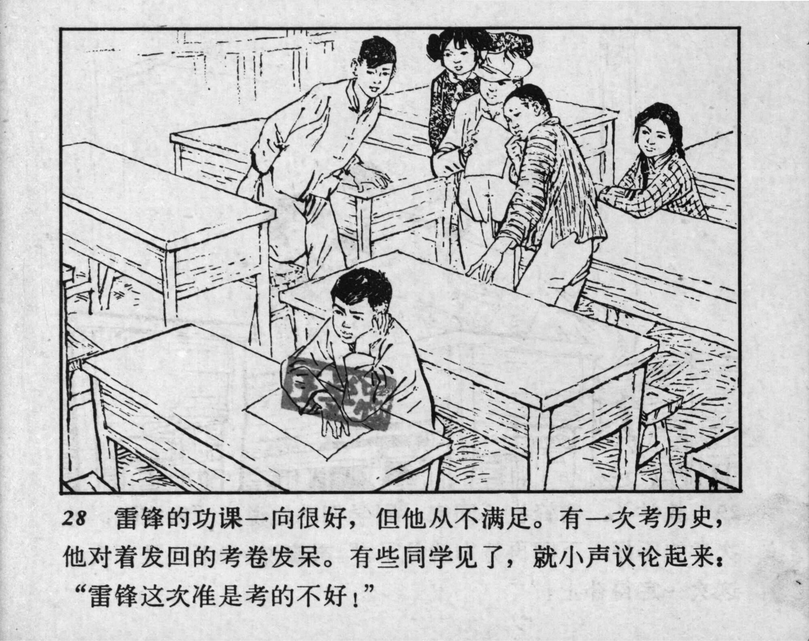



28 雷锋的功课一向很好，但他从不满足。有一次考历史，他对着发回的考卷发呆。有些同学见了，就小声议论起来：“雷锋这次准是考的不好！”

<--->

Lei Feng always excelled at his homework, but he was never complacent about it. Once, he looked blankly at the history exam paper that had just been returned. Some classmates whispered to each other as they noticed him, saying: “It seems that Lei Feng didn’t do well this time!” 


