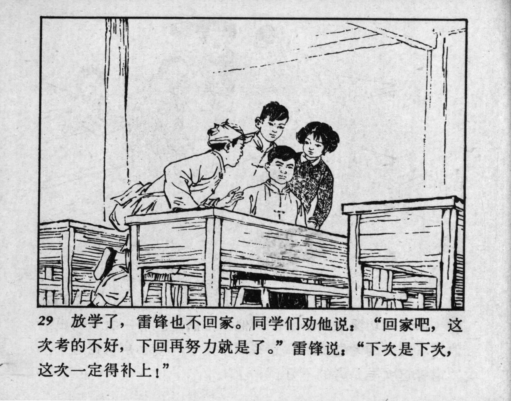



29 放学了，雷锋也不回家。同学们劝他说：“回家吧，这次考的不好，下回再努力就是了。”雷锋说： “下次是下次，这次一定得补上！”

<--->

Lei Feng didn’t go home after school. His classmates suggested: “Why don’t you go home? You didn’t do well this time but can try harder next time.” Lei Feng replied: “Next time is next time, but I need to make up for this time.” 


