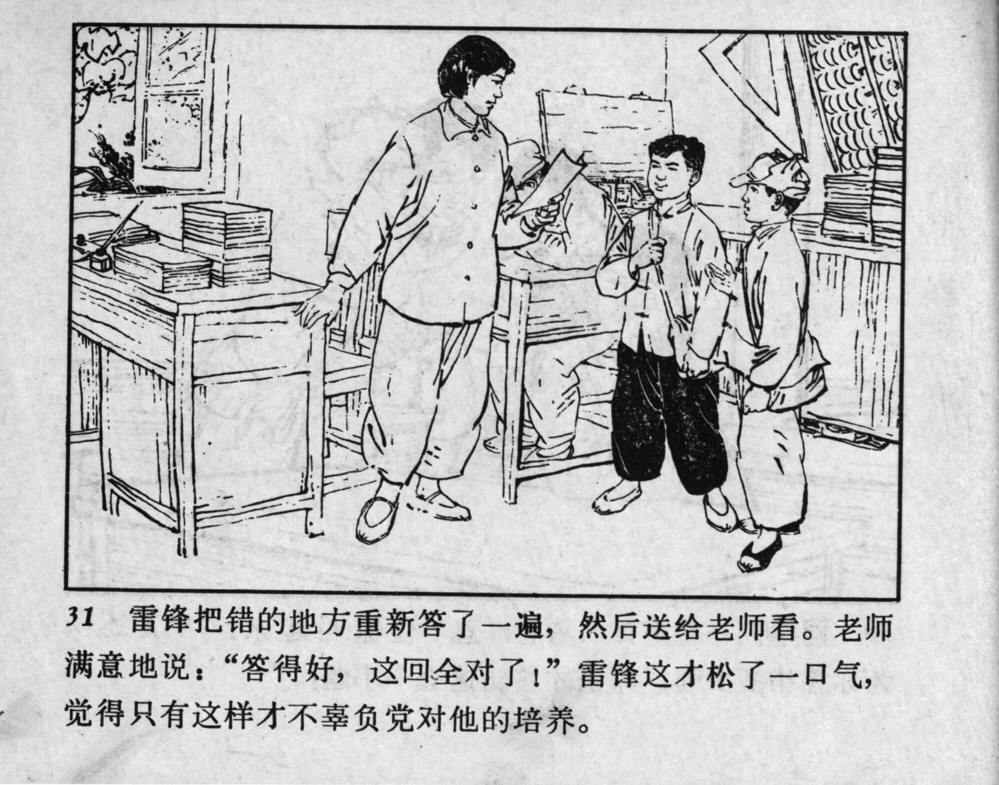



31 雷锋把错的地方重新答了一遍，然后送给老师看。老师满意地说：“答得好，这回全对了！”雷锋这才松了一口气，觉得只有这样才不辜负党对他的培养。

<--->

Lei Feng revised the incorrect question and submitted it to the teacher who said with satisfaction: “Well done! You got it all right this time!” Only now Lei Feng breathed a sigh of relief, believing that this was the only way to meet the expectations of the Party. 


