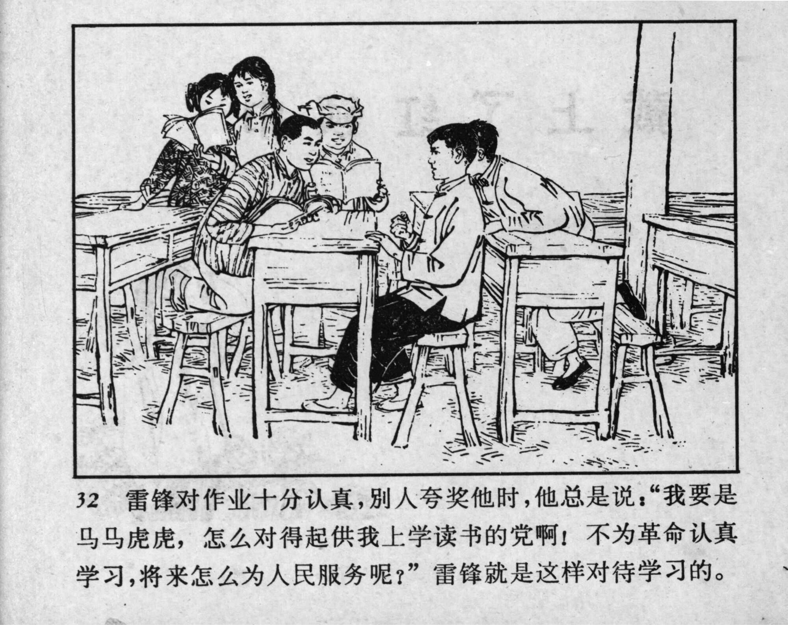



32 雷锋对作业十分认真，别人夸奖他时，他总是说：“我要是马马虎虎，怎么对得起供我上学读书的党啊！不为革命认真学习，将来怎么为人民服务呢？”雷锋就是这样对待学习的。

<--->

Lei Feng took his homework very seriously. Whenever others complimented him, he would respond: “If I were sloppy, how could I be worthy of the Party that sent me to school? How could I serve the people in the future if I didn’t study hard for the revolution?” This was Lei Feng’s approach to his studies. 


