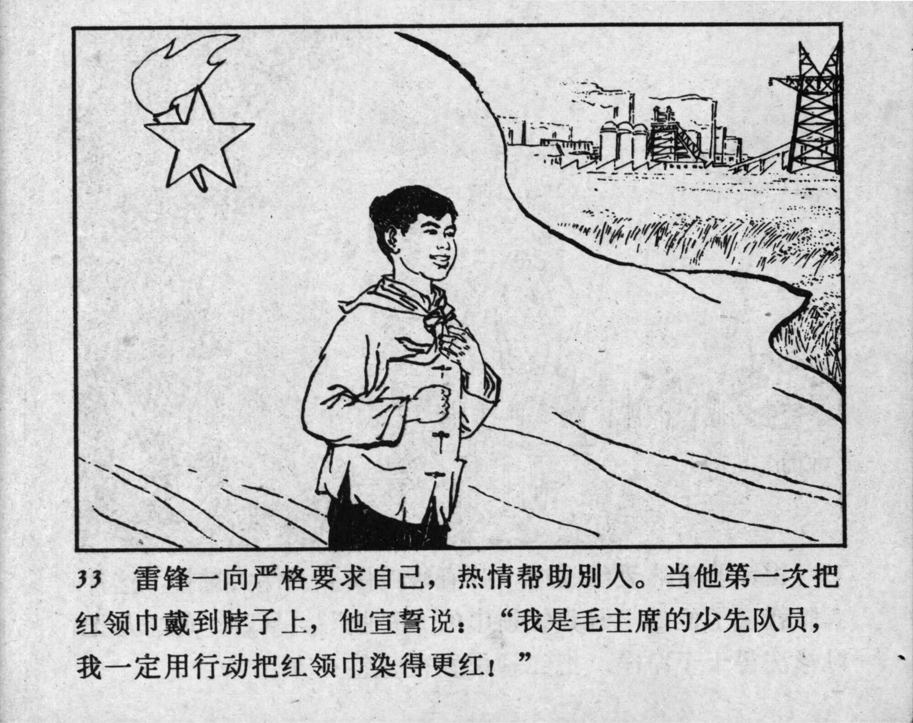



33 雷锋一向严格要求自己，热情帮助别人。当他第一次把红领巾戴到脖子上，他宣誓说：“我是毛主席的少先队员，我一定用行动把红领巾染得更红！”

<--->

Lei Feng always held himself to strict standards and enthusiastically helped others. When he first tied the red scarf around his neck, he took an oath: “I am a Young Pioneer of Chairman Mao, and I will make the red scarf even redder through my actions!”


