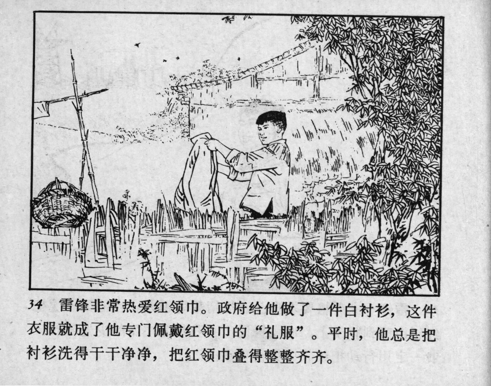



34 雷锋非常热爱红领巾。政府给他做了一件白衬衫，这件衣服就成了他专门佩戴红领巾的“礼服”。平时，他总是把衬衫洗得干干净净，把红领巾叠得整整齐齐。

<--->

Lei Feng had great affection for the red scarf. The government gave him a white shirt, and this became his special “uniform” for wearing the red scarf. He always kept the shirt clean and folded the red scarf neatly.


