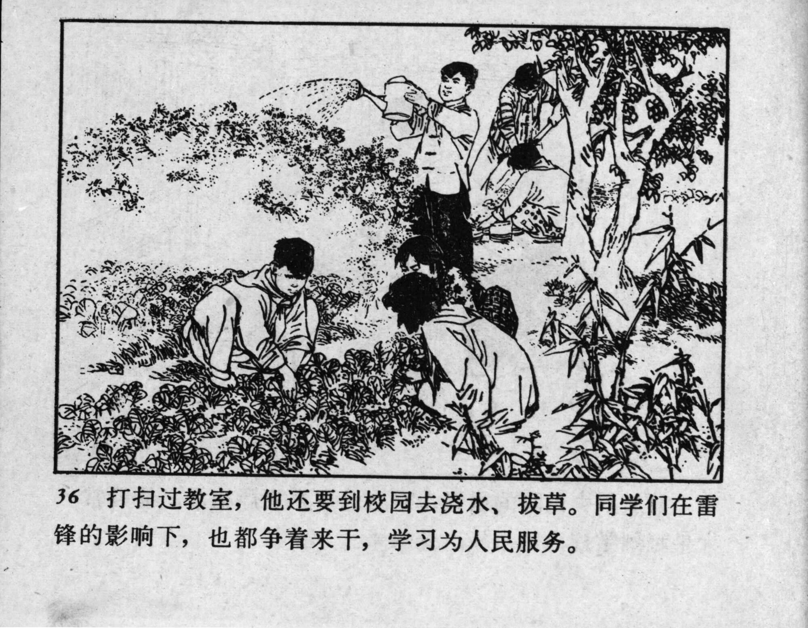



36 打扫过教室，他还要到校园去浇水、拔草。同学们在雷锋的影响下，也都争着来干，学习为人民服务。

<--->

After cleaning the classroom, he would go out to water the plants and pull weeds around the schoolyard. Inspired by Lei Feng, his classmates also competed to do good deeds and learn to serve the people.


