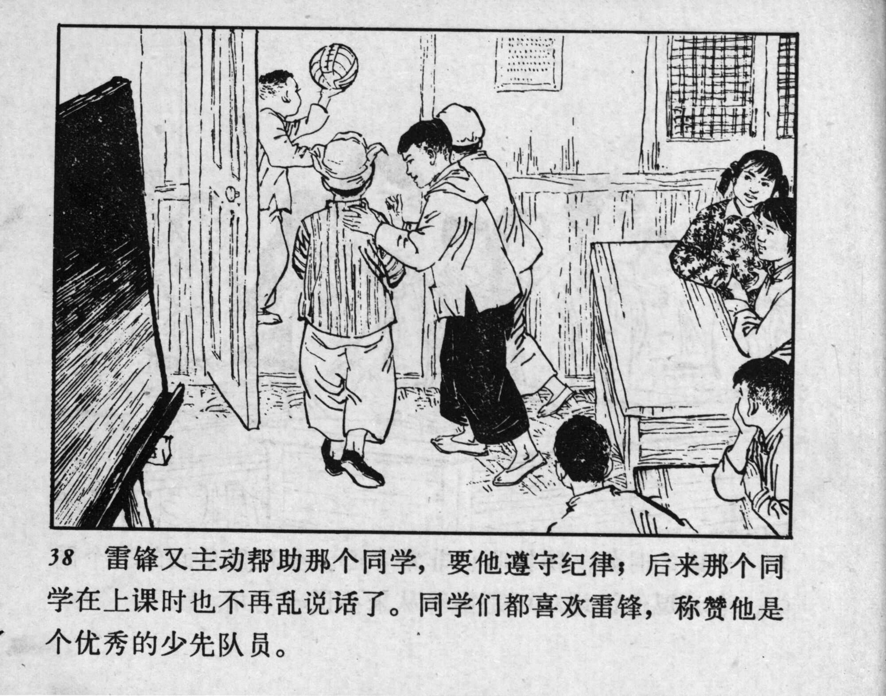



38 雷锋又主动帮助那个同学，要他遵守纪律；后来那个同学在上课时也不再乱说话了。同学们都喜欢雷锋，称赞他是个优秀的少先队员。

<--->

Lei Feng voluntarily helped that classmate by encouraging him to follow the rules. Eventually, that student stopped talking during class. Lei Feng’s classmates all liked him and praised him as an outstanding Young Pioneer.


