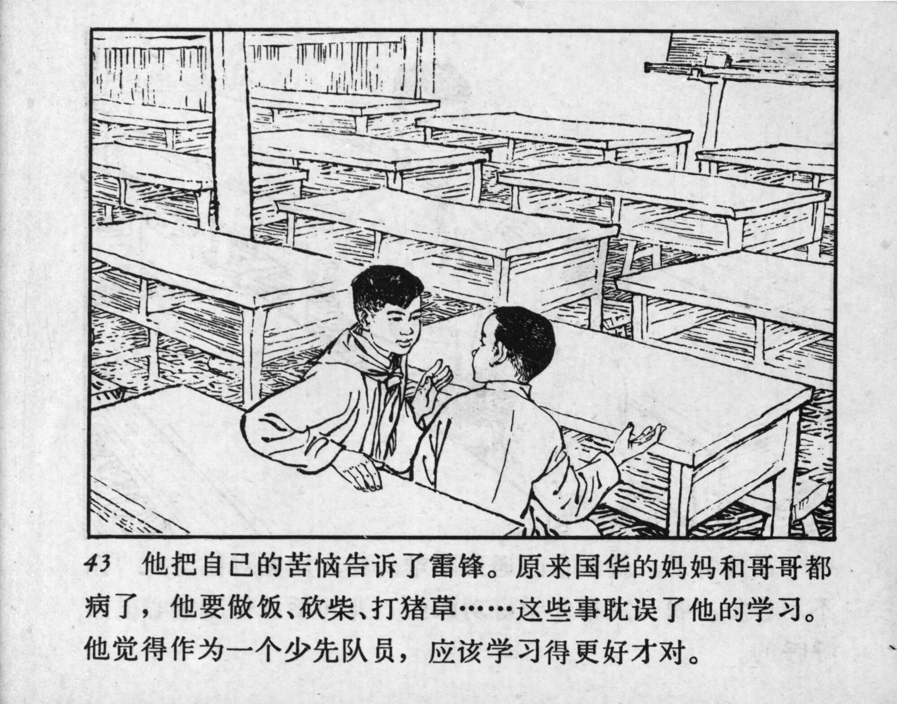



43 他把自己的苦恼告诉了雷锋。原来国华的妈妈和哥哥都病了，他要做饭、砍柴、打猪草……这些事耽误了他的学习。他觉得作为一个少先队员，应该学习得更好才对。

<--->

He shared his troubles with Lei Feng. It turned out that Guohua’s mother and brother were both ill, and he had to take on household tasks like cooking, chopping firewood, and gathering pig feed… These things delayed his studies. He felt that as a Young Pioneer, he should be performing better in school.


