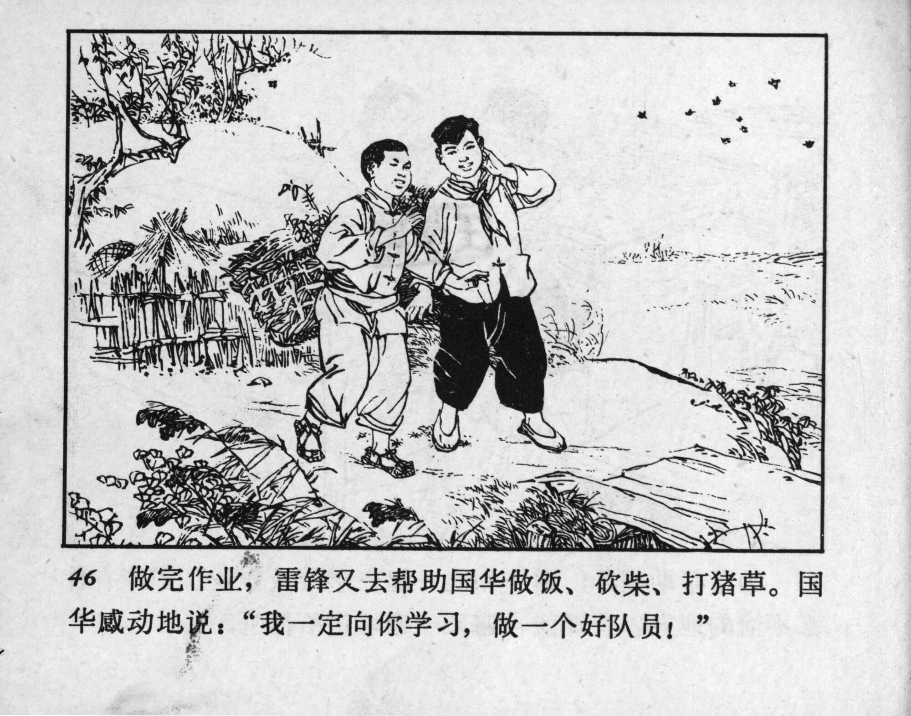



46 做完作业，雷锋又去帮助国华做饭、砍柴、打猪草。国华感动地说：“我一定向你学习，做一个好队员！”

<--->

After finishing their homework, Lei Feng also helped Guohua with cooking, chopping firewood, and gathering pig feed. Guohua was moved and said: “I will learn from you and become a good Young Pioneer!”


