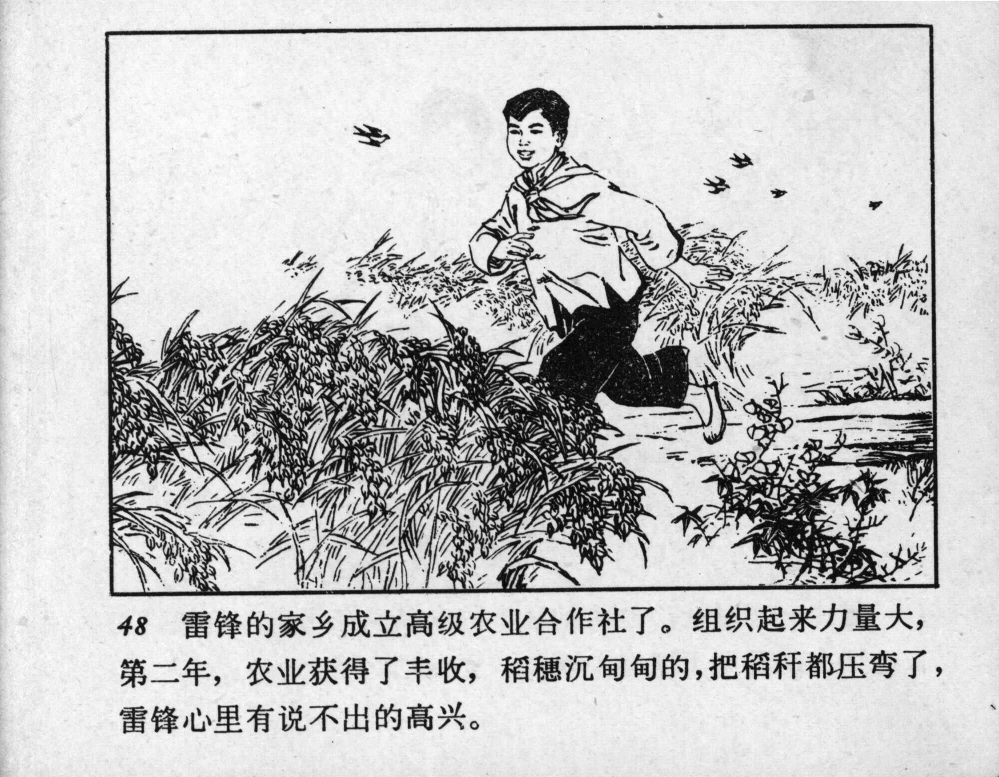



48 雷锋的家乡成立高级农业合作社了。组织起来力量大，第二年，农业获得了丰收，稻穗沉甸甸的，把稻秆都压弯了，雷锋心里有说不出的高兴。

<--->

An advanced agricultural cooperative was established in Lei Feng’s hometown. Working as a unit empowered everyone to work better; the following year, they reaped an abundant harvest. The rice stalks were so heavy with grain that they bent under the weight. Lei Feng was filled with indescribable joy.


