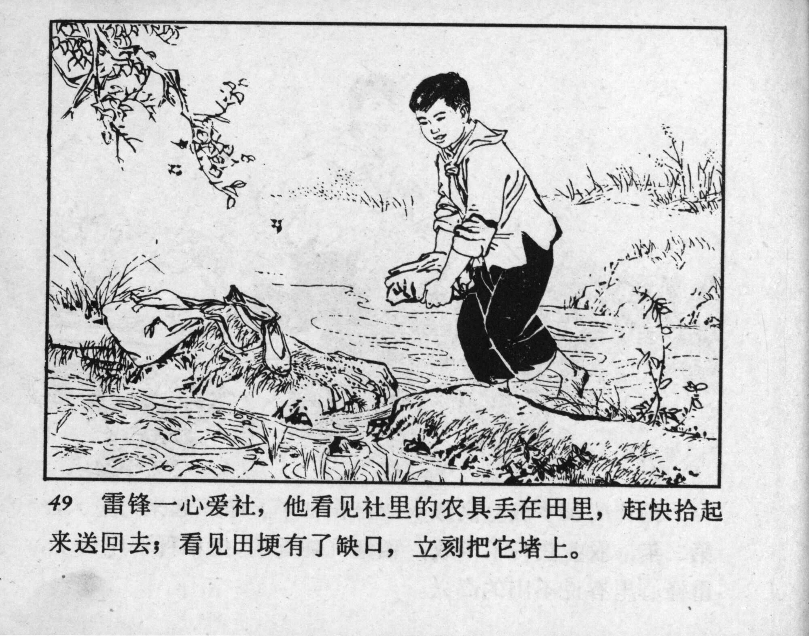



49 雷锋一心爱社，他看见社里的农具丢在田里，赶快拾起来送回去；看见田埂有了缺口，立刻把它堵上。

<--->

Lei Feng cared deeply for the cooperative. Whenever he saw farm tools left behind in the fields, he would quickly pick them up and return them. When he noticed gaps in the dikes, he immediately patched them.


