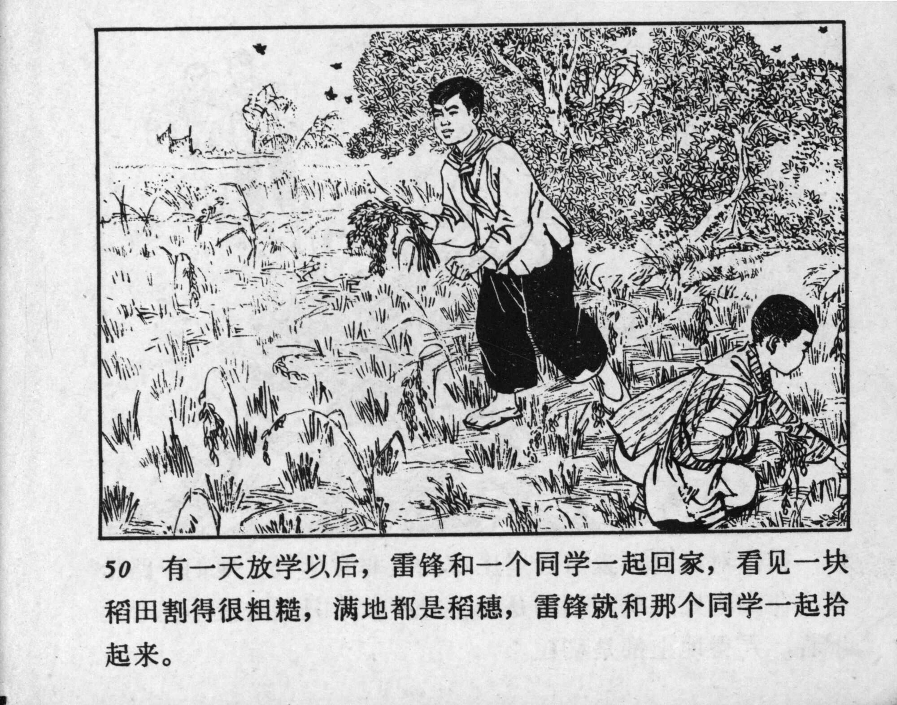



50 有一天放学以后，雷锋和一个同学一起回家，看见一块稻田割得很粗糙，满地都是稻穗，雷锋就和那个同学一起拾起来。

<--->

One day after school, Lei Feng and a classmate were walking home when they saw a rice field that had been harvested carelessly, and grain stalks were scattered all over the ground. On seeing this, Lei Feng and his classmate started gathering them.


