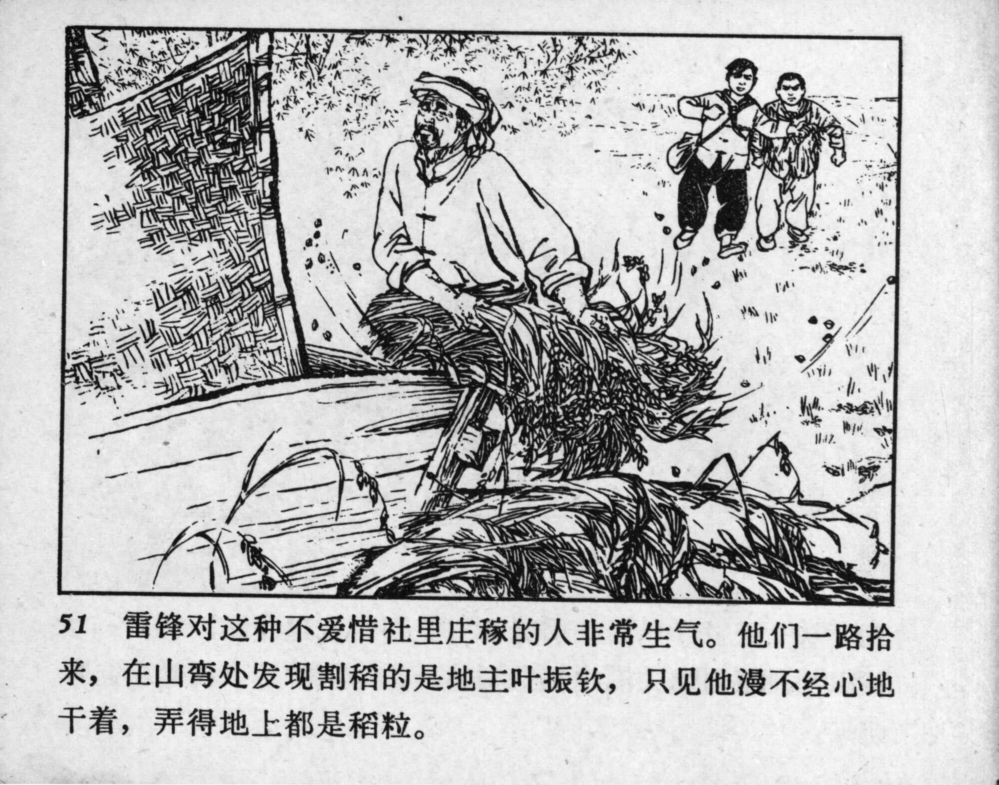



51 雷锋对这种不爱惜社里庄稼的人非常生气。他们一路拾来，在山弯处发现割稻的是地主叶振钦，只见他漫不经心地干着，弄得地上都是稻粒。

<--->

Lei Feng was furious at those who didn’t cherish the cooperative’s crops. As they gathered the scattered grain, they came across the person responsible—a landlord named Ye Zhenqin. They saw him working lazily, leaving rice grains all over the ground.


