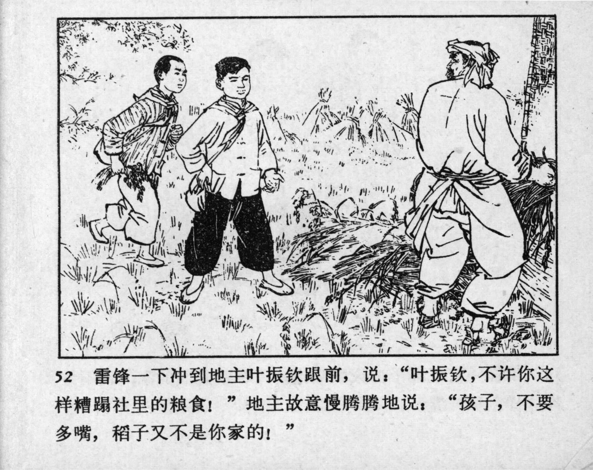



52 雷锋一下冲到地主叶振钦跟前，说：“叶振钦，不许你这样糟蹋社里的粮食！”地主故意慢腾腾地说：“孩子，不要多嘴，稻子又不是你家的！”

<--->

Lei Feng stormed up to the landlord and said: “Ye Zhenqin, you are not allowed to waste the cooperative’s grain like this!” Ye Zhenqin, the landlord, slowly and dismissively, replied: “Kid, keep your mouth shut. Then again, the rice isn’t from your family!”


