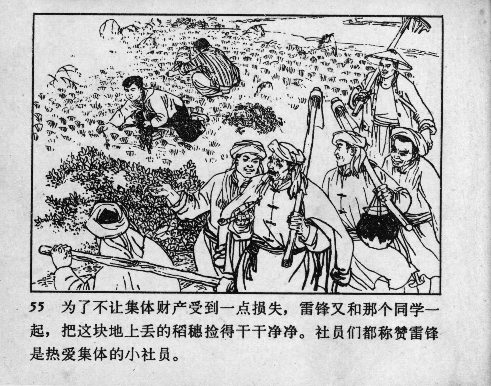



55 为了不让集体财产受到一点损失，雷锋又和那个同学一起，把这块地上丢的稻穗捡得干干净净。社员们都称赞雷锋是热爱集体的小社员。

<--->

Determined to prevent any loss to the collective property, Lei Feng and his classmate worked together to pick up every single grain left in the field. The cooperative members all praised Lei Feng, calling him a young member who truly loved the collective.


