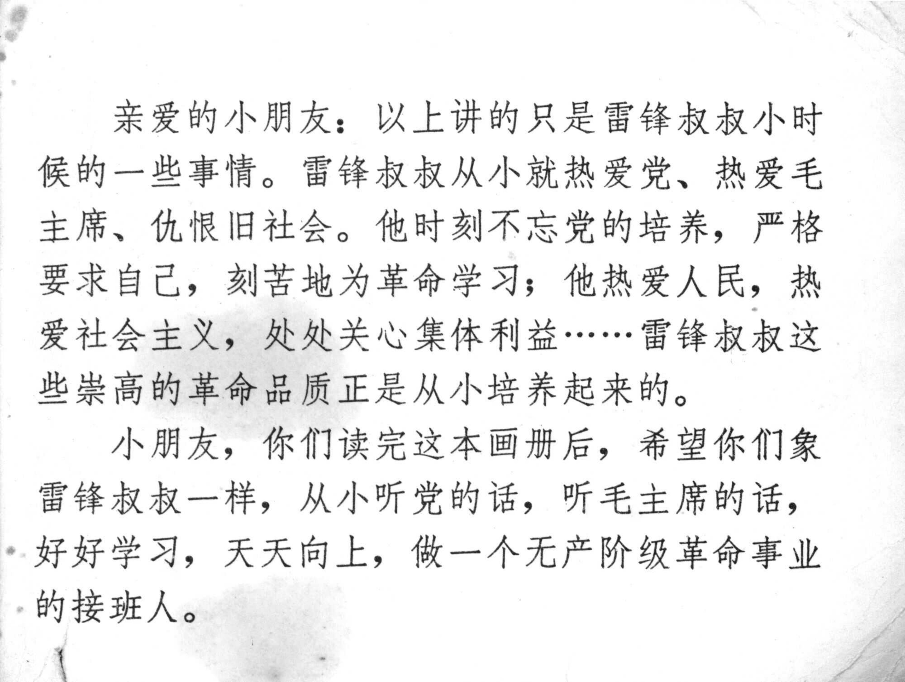



亲爱的小朋友：以上讲的只是雷锋叔叔小时候的一些事情。雷锋叔叔从小就热爱党、热爱毛主席、仇恨旧社会。他时刻不忘党的培养，严格要求自己，刻苦地为革命学习；他热爱人民，热爱社会主义，处处关心集体利益......雷锋叔叔这些崇高的革命品质正是从小培养起来的。
小朋友，你们读完这本画册后，希望你们象雷锋叔叔一样，从小听党的话，听毛主席的话，好好学习，天天向上，做一个无产阶级革命事业的接班人。

<--->

Dear Little Friends: The story above is just a glimpse of what Uncle Lei Feng was like as a child. From a young age, Uncle Lei Feng loved the Party, loved Chairman Mao, and despised the old society. He always remembered the Party’s nurturing, set high standards for himself, and worked hard in his studies for the revolution. He loved the people, loved socialism, and always cared for the interests of the collective… Uncle Lei Feng cultivated these noble revolutionary qualities from a young age.
Little friends, after reading this lianhuanhua, hopefully, you will follow Uncle Lei Feng’s example. From a young age, listen to the Party, listen to Chairman Mao, study hard, make progress every day, and strive to become successors to the revolutionary cause of the proletariat.


