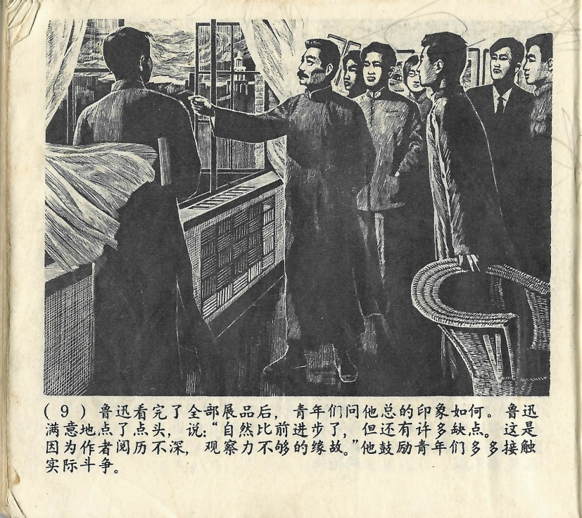



鲁迅看完了全部展品后，青年们问他总的印象如何。鲁迅满意地点了点头，说：“自然比前进步了，但还有许多缺点。这是因为作者阅历不深，观察力不够的缘故。”他鼓励青年们多多接触实际斗争。

<--->

Nachdem sich Lu Xun alle Ausstellungsstücke angesehen hatte, fragten ihn die jungen nach seinem Gesamteindruck. Lu Xun nickte zufrieden und sagte: „Natürlich gibt es Fortschritte zu früher. Aber es gibt auch noch einige Mängel. Dies liegt an mangelnder Erfahrung und unzureichender Beobachtungsgabe.“ Er ermutigte die jungen Leute sich mehr dem realen Kampf zu widmen. 

